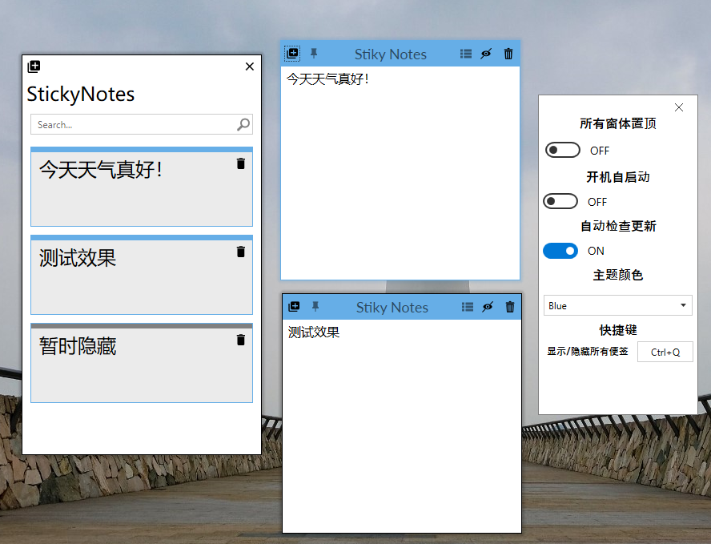
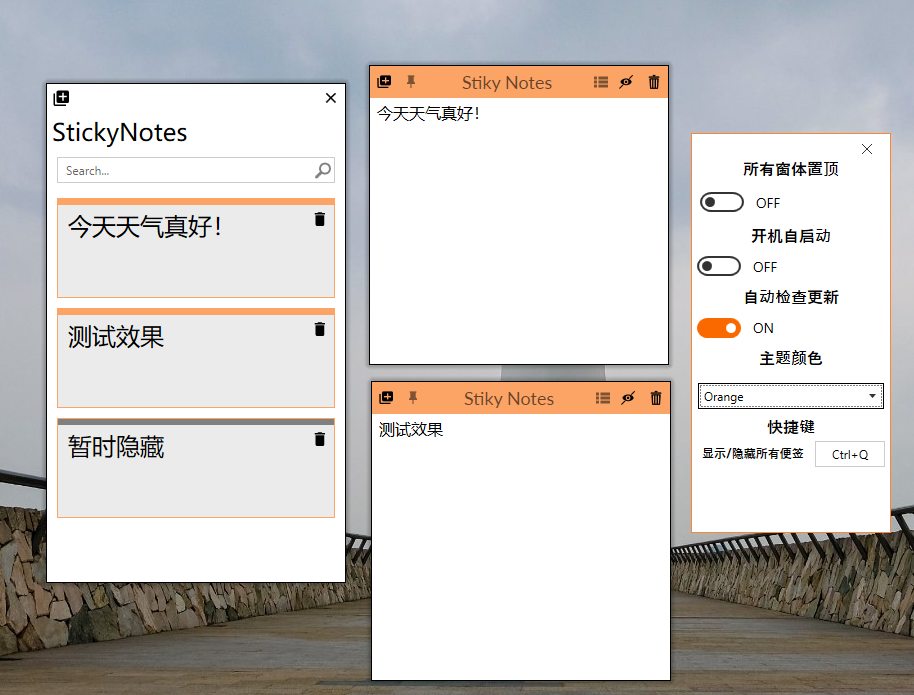

# StikyNotes

一个简单清爽的的Windows桌面便利贴

# 官网

[http://stickynotes.lizhenghao.site](http://stickynotes.lizhenghao.site)

## 安装 Installation

点击下载安装运行即可[点击此处打开下载页面](https://github.com/li-zheng-hao/StikyNotes/releases)

## 一些特性 Features

1. 支持字体放大和缩小
2. 开机自启动
3. 窗口置顶
4. 定时保存
5. 窗体靠上边缘自动吸附隐藏，鼠标上移显示
6. 支持多个窗体主题
7. 全局快捷键功能
8. 自动更新

## 程序截图

